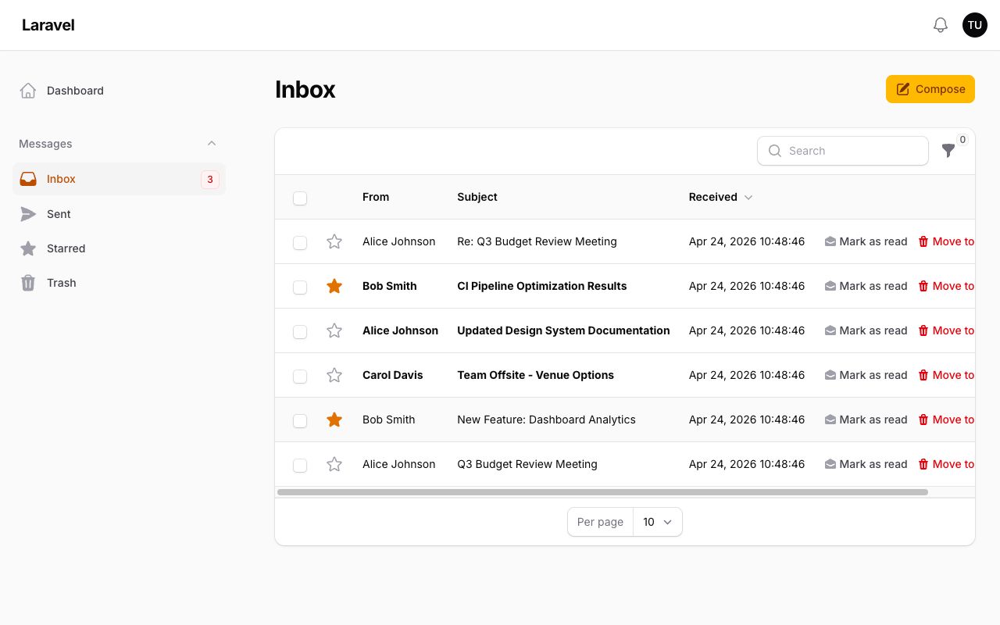
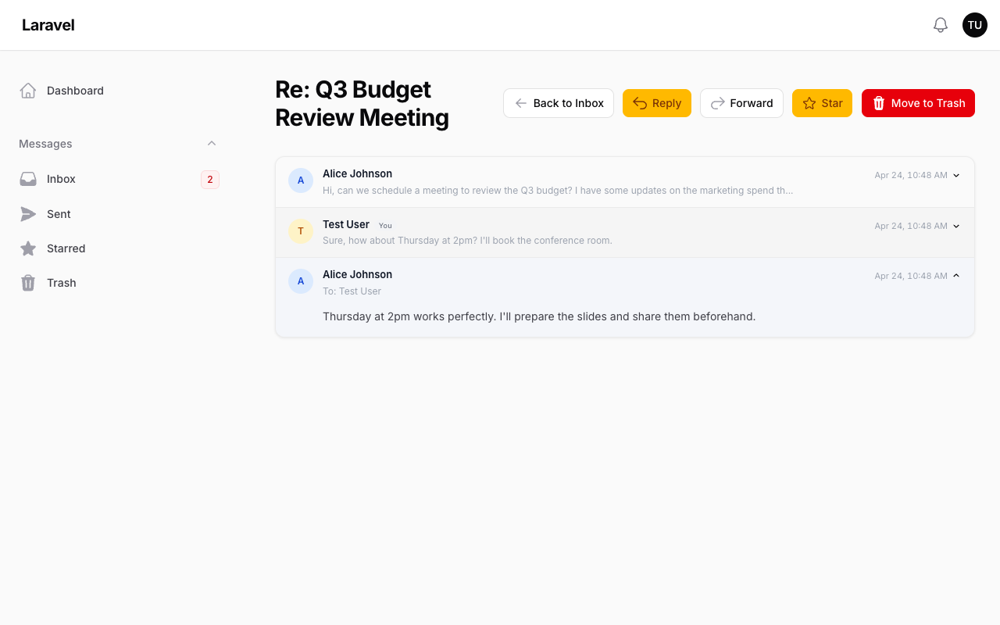
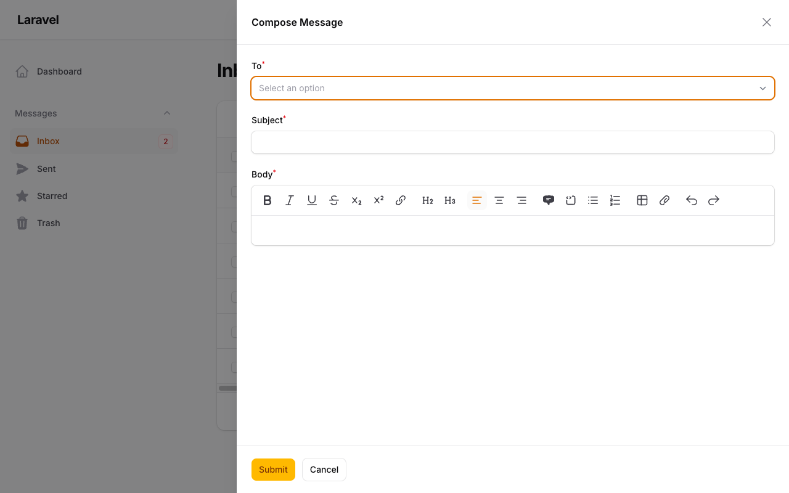
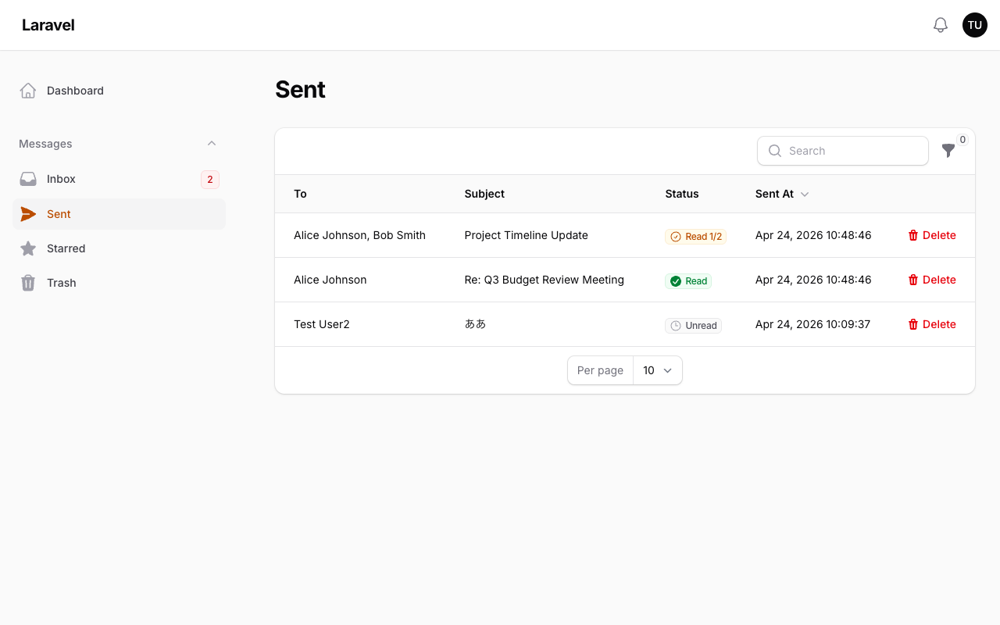

# Filament Inbox

[](https://github.com/qalainau/filament-inbox/actions/workflows/ci.yml)
[](https://packagist.org/packages/qalainau/filament-inbox)
[](https://packagist.org/packages/qalainau/filament-inbox)

Email-like inbox messaging plugin for [Filament v5](https://filamentphp.com). Add a complete internal messaging system to your admin panel — inbox, sent, starred, trash, threading, forwarding, read receipts, and more.

## Screenshots

### Inbox


### Thread View


### Compose Message


### Sent Messages with Read Receipts


## Features

- **Inbox, Sent, Starred, Trash** — Full Gmail-style navigation
- **Message Threading** — Reply and Reply All with threaded conversations
- **Message Forwarding** — Forward messages with original headers
- **Read Receipts** — Per-recipient read tracking with status indicators
- **Star Messages** — Mark important messages for quick access
- **Rich Text Editor** — Compose messages with formatting and file attachments
- **Bulk Actions** — Mark as read, move to trash in batch
- **Search & Filters** — Filter by sender, unread, starred
- **Database Notifications** — Filament native notifications on new messages
- **Stats Widget** — Unread, total, and starred message counts
- **Dark Mode** — Full dark mode support
- **Multi-tenancy** — Filament native tenant scoping
- **Configurable User Model** — Works with any authenticatable model
- **Laravel Events** — Hook into MessageSent, MessageRead, MessageStarred, MessageTrashed, MessageRestored, MessageForwarded
- **Test Factories** — Message and MessageRecipient factories included
- **i18n** — English, Japanese, Spanish, French, Portuguese (BR), Chinese (Simplified), Korean, German

## Requirements

- PHP 8.2+
- Laravel 12+
- Filament v5

## Installation

```bash
composer require qalainau/filament-inbox
```

Run migrations:

```bash
php artisan migrate
```

Add the `HasInbox` trait to your User model:

```php
use FilamentInbox\Concerns\HasInbox;

class User extends Authenticatable
{
    use HasInbox;
}
```

Register the plugin in your Filament panel:

```php
use FilamentInbox\FilamentInboxPlugin;

public function panel(Panel $panel): Panel
{
    return $panel
        ->databaseNotifications()
        ->plugin(FilamentInboxPlugin::make());
}
```

## Configuration

Publish the config file:

```bash
php artisan vendor:publish --tag=filament-inbox-config
```

```php
// config/filament-inbox.php
return [
    // Custom user model (defaults to auth provider model)
    'user_model' => null,

    // Custom users table name (auto-detected from model)
    'users_table' => null,

    // Tenant-users relationship method on tenant model
    // Auto-detects 'members' or 'users' if null
    'tenant_users_relationship' => null,
];
```

## Multi-tenancy

Filament Inbox works with Filament's built-in tenancy. When tenancy is active:

- Messages are scoped to the current tenant
- Recipient options are limited to tenant members
- Tenant is automatically attached to new messages

No additional configuration is needed if your tenant model has a `members()` or `users()` relationship.

## Events

Listen to messaging events in your `EventServiceProvider` or with `Event::listen()`:

| Event | Dispatched When |
|-------|----------------|
| `MessageSent` | A message or reply is sent |
| `MessageRead` | A message is marked as read |
| `MessageStarred` | A message is starred or unstarred |
| `MessageTrashed` | A message is moved to trash |
| `MessageRestored` | A message is restored from trash |
| `MessageForwarded` | A message is forwarded |

## Testing

```bash
composer test
```

## Changelog

Please see [CHANGELOG](CHANGELOG.md) for more information on what has changed recently.

## License

The MIT License (MIT). Please see [License File](LICENSE) for more information.
